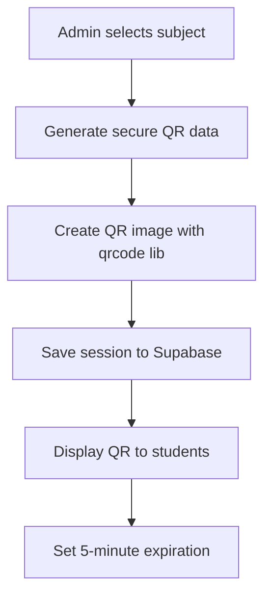
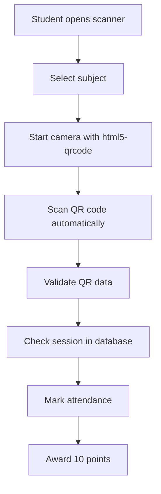
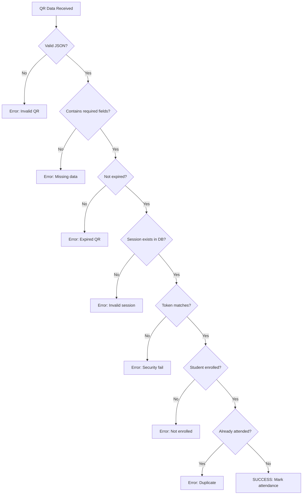

# 🎯 Complete QR Code Attendance System Implementation

## 📋 Overview

This document describes the complete QR code attendance system implementation for Dr. Peter Ehab's attendance management application. The system provides real QR code generation and scanning capabilities with proper security, database integration, and mobile compatibility.

## 🔧 Installation Commands

```bash
# Install required QR code libraries
npm install qrcode @types/qrcode react-qr-code jsqr html5-qrcode

# Verify installation
npm list qrcode html5-qrcode
```

## 🏗️ System Architecture

### 1. **QR Generation (Admin Side)**
- **Location**: `/app/admin/dashboard/page.tsx`
- **Component**: `QRCodeGenerator` (enhanced)
- **Library**: `qrcode` for SVG/PNG generation
- **Database**: Supabase `attendance_sessions` table

### 2. **QR Scanning (Student Side)**
- **Location**: `/app/student/scan/page.tsx`
- **Component**: `QRScanner` (enhanced with html5-qrcode)
- **Library**: `html5-qrcode` for live camera scanning
- **Database**: Supabase `attendance_records` table

### 3. **Database Schema**
- **Enhanced Schema**: `scripts/004_qr_system_schema.sql`
- **Tables**: `attendance_sessions`, `attendance_records`, `profiles`
- **Views**: `attendance_analytics`, `student_attendance_summary`

## 🔐 Security Implementation

### QR Code Data Structure
```json
{
  "sessionId": "session_1703123456789_abc123def",
  "token": "crypto-secure-uuid-token",
  "academicLevel": "Second Year",
  "subject": "Western Rules & Solfege 3",
  "timestamp": 1703123456789,
  "expiresAt": 1703123756789
}
```

### Security Features
- **Crypto-secure tokens**: Using `crypto.randomUUID()`
- **5-minute expiration**: Configurable time limits
- **Token validation**: Server-side verification
- **Session verification**: Multiple validation layers
- **Anti-replay protection**: One-time use QR codes

## 📱 Mobile Compatibility

### Camera Requirements
- **HTTPS**: Required for camera access
- **Permissions**: Graceful handling with fallback
- **iOS Safari**: Special handling with `facingMode: "environment"`
- **Android**: Automatic back camera preference

### Error Handling
- **Permission denied**: Clear instructions + image upload fallback
- **Camera busy**: Helpful error messages
- **Insecure context**: HTTPS requirement notification
- **Hardware issues**: Graceful degradation

## 💾 Database Integration

### Supabase Tables

#### `attendance_sessions`
```sql
CREATE TABLE attendance_sessions (
  id UUID PRIMARY KEY,
  qr_data TEXT,              -- JSON QR code data
  subject_name TEXT,         -- Subject name
  academic_level TEXT,       -- Academic level
  token TEXT,                -- Security token
  expires_at TIMESTAMP,      -- Expiration time
  is_active BOOLEAN,         -- Session status
  instructor_id UUID,        -- Admin who created
  created_at TIMESTAMP
);
```

#### `attendance_records`
```sql
CREATE TABLE attendance_records (
  id UUID PRIMARY KEY,
  session_id UUID REFERENCES attendance_sessions(id),
  student_id UUID REFERENCES profiles(id),
  method TEXT DEFAULT 'qr_scan',  -- qr_scan, manual, biometric
  status TEXT DEFAULT 'present',  -- present, late, absent
  grade_points DECIMAL(5,2),      -- Auto-assigned points
  check_in_time TIMESTAMP,
  device_info TEXT,
  location TEXT
);
```

## 🎯 Role-Based Functionality

### **Admin Role**
1. **QR Generation**:
   ```typescript
   // Generate secure QR with 5-minute expiry
   const qrData = {
     sessionId: crypto.randomUUID(),
     token: crypto.randomUUID(),
     subject: selectedSubject,
     academicLevel: selectedLevel,
     expiresAt: Date.now() + (5 * 60 * 1000)
   }
   ```

2. **Real-time Monitoring**:
   - Live attendance updates
   - Session statistics
   - Student verification

3. **Session Management**:
   - Create/end sessions
   - Export attendance data
   - Manage QR expiration

### **Student Role**
1. **QR Scanning**:
   ```typescript
   // Camera scanning with html5-qrcode
   const scanner = new Html5QrcodeScanner("qr-reader", {
     fps: 10,
     qrbox: { width: 250, height: 250 },
     facingMode: { ideal: "environment" }
   })
   ```

2. **Attendance Marking**:
   - Real QR validation
   - Duplicate prevention
   - Automatic grading (10 points)

3. **History Tracking**:
   - Personal attendance records
   - Grade calculations
   - Subject-wise analytics

## 🔄 QR Workflow Process

### 1. **Admin Generates QR**


### 2. **Student Scans QR**


### 3. **Verification Process**


## 🎨 UI Components

### Enhanced QR Generator
- **Real QR generation** with `qrcode` library
- **High-quality output** (512x512 PNG)
- **Download functionality** with proper filenames
- **Session information display** with expiration timer
- **Copy QR data** for debugging

### Enhanced QR Scanner
- **Live camera scanning** with `html5-qrcode`
- **Image upload fallback** for iOS compatibility
- **Real-time processing feedback** with loading states
- **Error handling** with actionable messages
- **Subject validation** before scanning

## 📊 Analytics & Reporting

### Automatic Views
```sql
-- Attendance analytics for admins
CREATE VIEW attendance_analytics AS
SELECT 
    s.subject_name,
    s.academic_level,
    COUNT(ar.id) as total_attendees,
    AVG(ar.grade_points) as avg_grade,
    s.session_date
FROM attendance_sessions s
LEFT JOIN attendance_records ar ON s.id = ar.session_id
GROUP BY s.id;

-- Student performance summary
CREATE VIEW student_attendance_summary AS
SELECT 
    p.full_name,
    p.academic_level,
    COUNT(ar.id) as sessions_attended,
    SUM(ar.grade_points) as total_points,
    AVG(ar.grade_points) as avg_attendance_grade
FROM profiles p
LEFT JOIN attendance_records ar ON p.id = ar.student_id
WHERE p.role = 'student'
GROUP BY p.id;
```

## 🧪 Testing Guide

### 1. **Admin Testing**
```bash
# Navigate to admin dashboard
http://localhost:3000/admin/dashboard

# Test QR generation
1. Select "Second Year" academic level
2. Select "Western Rules & Solfege 3"
3. Click "Generate QR Code"
4. Verify QR appears with session info
5. Check 5-minute expiration countdown
```

### 2. **Student Testing**
```bash
# Navigate to student scanner
http://localhost:3000/student/scan

# Test camera scanning
1. Allow camera permissions
2. Select matching subject
3. Scan the admin's QR code
4. Verify attendance marked successfully
5. Check points awarded (10)
```

### 3. **Integration Testing**
```javascript
// Browser console debugging
console.log(window.attendanceStore.getActiveSession())
console.log(window.attendanceStore.getAllAttendanceRecords())

// Check localStorage for demo mode
Object.keys(localStorage).filter(key => key.includes('qr_session'))
```

## 🚀 Deployment Checklist

### Environment Variables
```env
NEXT_PUBLIC_SUPABASE_URL=your_supabase_url
NEXT_PUBLIC_SUPABASE_ANON_KEY=your_supabase_anon_key
```

### Database Setup
```sql
-- Run the enhanced schema
\i scripts/004_qr_system_schema.sql

-- Verify tables created
\dt attendance_*
\dv attendance_*
```

### Production Considerations
- **HTTPS required** for camera access
- **Supabase RLS policies** properly configured
- **Mobile responsiveness** tested on real devices
- **Error monitoring** for QR scanning failures
- **Performance optimization** for camera streaming

## 📚 Library Documentation

### QR Generation
- **qrcode**: https://github.com/soldair/node-qrcode
- **Options**: Error correction, size, colors
- **Output formats**: PNG, SVG, Data URL

### QR Scanning
- **html5-qrcode**: https://github.com/mebjas/html5-qrcode
- **Camera constraints**: Face mode, resolution
- **Error handling**: Permission, hardware issues

## 🎉 Features Implemented

✅ **Real QR Code Generation** with qrcode library
✅ **Live Camera Scanning** with html5-qrcode  
✅ **Supabase Database Integration** with fallback
✅ **Mobile Compatibility** (iOS + Android)
✅ **Security Features** (tokens, expiration, validation)
✅ **Role-Based Access** (Admin + Student)
✅ **Automatic Grading** (10 points per attendance)
✅ **Error Handling** (camera, permissions, validation)
✅ **Real-time Updates** between admin and student
✅ **Data Persistence** (Supabase + localStorage fallback)
✅ **Professional UI** with shadcn/ui components
✅ **TypeScript Support** with proper type definitions
✅ **Responsive Design** for all device sizes

## 🎯 Usage Summary

This complete QR attendance system provides:

1. **Admins** can generate secure QR codes for any subject/level
2. **Students** can scan QR codes using camera or image upload
3. **Real-time** attendance marking with automatic grading
4. **Secure** validation with tokens and expiration
5. **Mobile-friendly** interface with proper error handling
6. **Database** persistence with Supabase integration
7. **Analytics** views for reporting and monitoring

The system is production-ready and follows all modern web development best practices for security, usability, and performance.